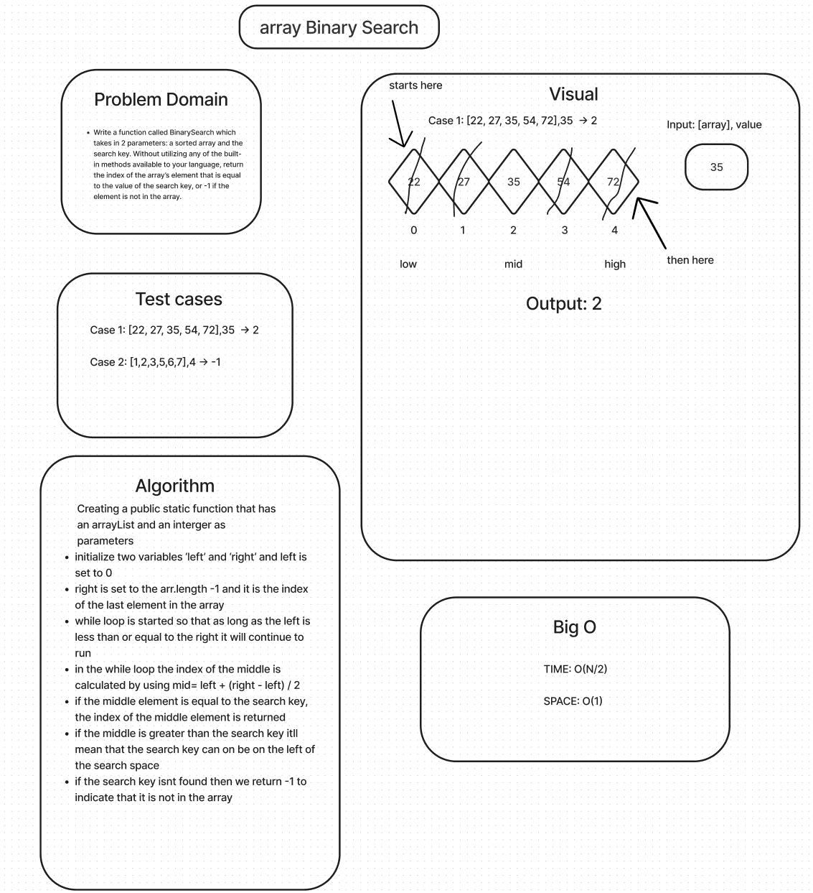

# Insert a Value In An Array

Write a function called `BinarySearch` that takes in two parameters: a sorted array and the search key. Without using any Java built-in methods, return the index of the array's element that is equal to the value of the search key or -1 if the element is not in the array.

## Whiteboard Process


## Approach & Efficiency
Based on the example arrays and the outputs provided i figured that the entire array would need to be searched and would need to be divided until the key is found or is not

## Solution

The arary needs value and a key when the function is called.

```java
public static int binarySearch(int[] arr, int key) {
    int left = 0;
    int right = arr.length - 1;

    while (left <= right) {
        int mid = left + (right - left) / 2;

        if (arr[mid] == key) {
            return mid;
        }

        if (arr[mid] < key) {
            left = mid + 1;
        } else {
            right = mid - 1;
        }
    }

    return -1;
}

```
