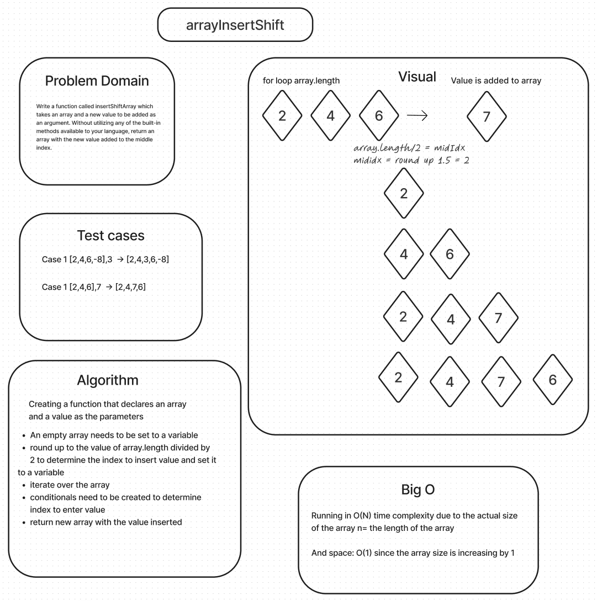

# Insert to Middle of an Array

Write a function called `insertShiftArray` which takes an array and a new value to be added as an argument. Without utilizing any of the built-in methods available to your language, return an array with the new value added to the middle index.

## Whiteboard Process



## Approach & Efficiency

The most efficient way to get the desired outcome was to first draw out how the value needed to get to the index location.

### Thoughts

Google was also my friend with this solution and to better understand the syntax to relate to the logic I need to add comments.

### Code


```java
public static int[] insertShiftArray(int [] arr, int value) {
int [] newArr = new int[arr.length + 1];
int mid = getMid(arr);
for (int i = 0; i < output.length; i++) {
        if (i == center)
            output[i] = value;
        else if (i < center)
            output[i] = arr[i];
        else
            output[i] = arr[i - 1];
    }
    return output;
}

public static int getCenter(int[] arr) {
    boolean isEven = arr.length % 2 == 0;
    if (isEven)
        return arr.length / 2;
    else
        return arr.length / 2 + 1;
}
```
