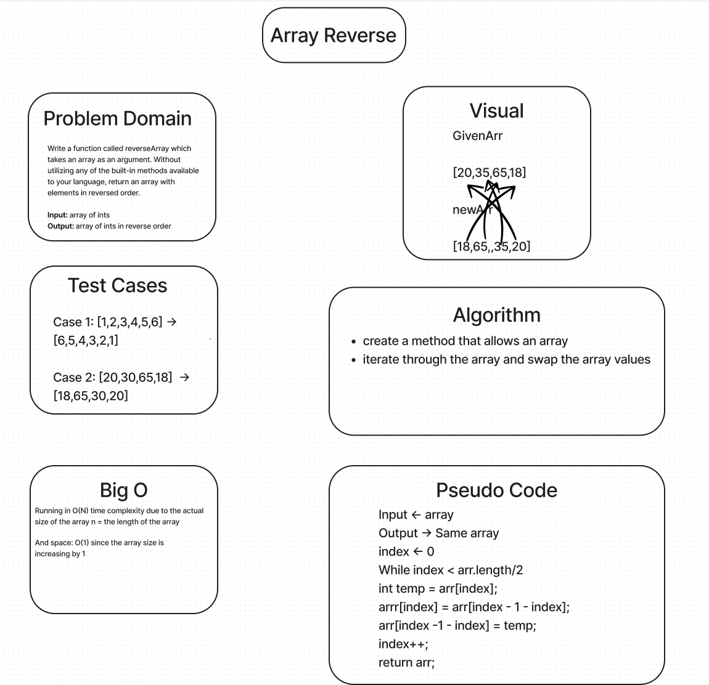

# Reverse an Array

Write a function called `reverseArray` which takes an array as an argument. Without utilizing any of the built-in methods available to your language, return an array with elements in reversed order.

## Whiteboard Process



## Approach & Efficiency

I know that i needed to get the array to swap its position by using a while loop.

### Thoughts

I had to look this solution up. It makes sense in my head on what needs to be done but syntax wise I couldnt get very far.

### Code

```java
public static int[] reverseArray(int[] arr) {
  int index = 0;
  while(index < arr.length / 2) {
    int temp = arr[index];
    arr[index] = arr[index - 1 - index];
    arr[index - 1 - index] = temp;
    index++;
  }
  return arr;
}
```
