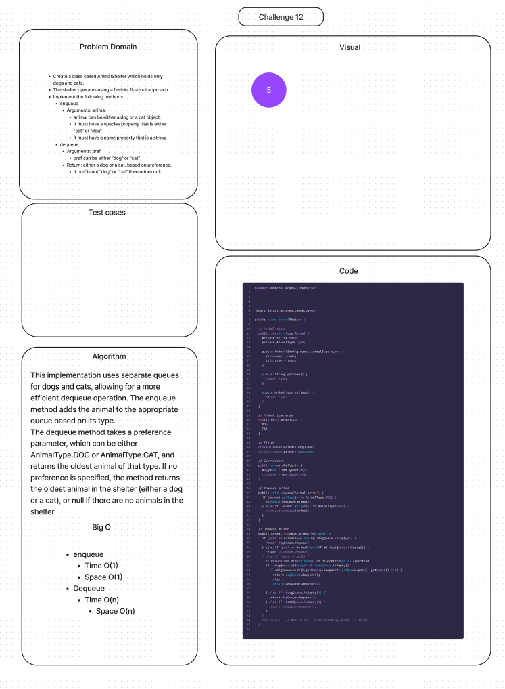

# Stacks and Queues Pseudo

## Features

### Stack

- Create a class called AnimalShelter which holds only dogs and cats.
- The shelter operates using a first-in, first-out approach.
- Implement the following methods:
  - enqueue
    - Arguments: animal
    - animal can be either a dog or a cat object.
    - It must have a species property that is either "cat" or "dog"
    - It must have a name property that is a string.
  - dequeue
    - Arguments: pref
    - pref can be either "dog" or "cat"
    - Return: either a dog or a cat, based on preference.
    - If pref is not "dog" or "cat" then return null.

**Stretch Goal**

If a cat or dog isn’t preferred, return whichever animal has been waiting in the shelter the longest.

## Whiteboard Process

## Approach & Efficiency

The enqueue method inserts the animal at the end of the respective queue.
The dequeue method returns the oldest animal from both queues, or null if both queues are empty. This operation takes O(1) time complexity as it just compares the names of the animals at the front of both queues, which takes constant time.

- enqueue:
  - Time: O(1)
  - Space: O(1)

- dequeue:
  - Time: O(1)
  -  Space: O(n)

## Solution

[Link to AnimalShelter Class](lib/src/main/java/codechallenges/AnimalShelter.java)

[Link to AnimalShelter Tests](lib/src/test/java/codechallenges/AnimalShelterTest.java)
