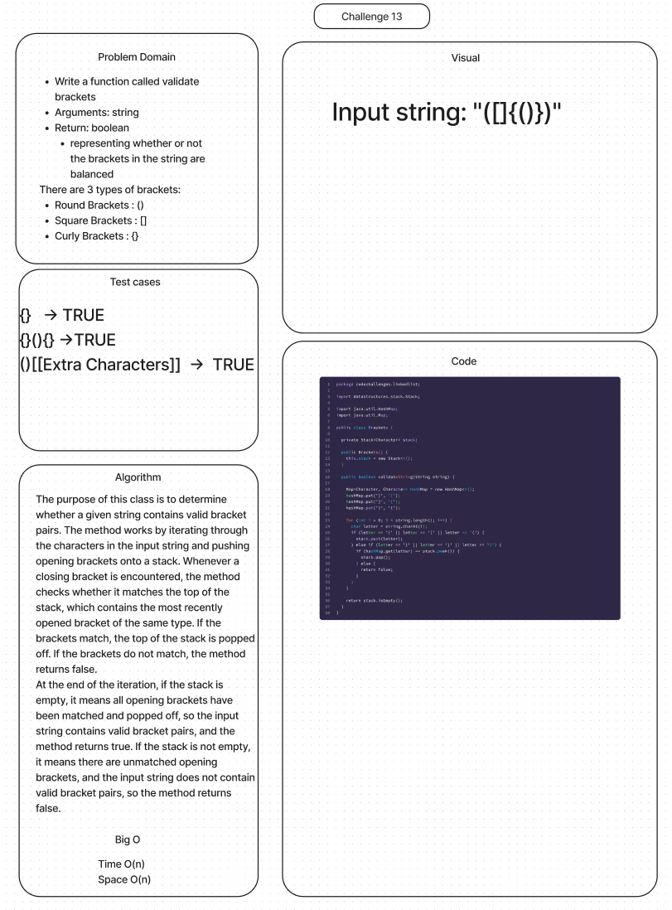

# Stacks and Queues Brackets

## Features

### Stack

- Write a function called validate brackets
  - Arguments: string
  - Return: boolean
    - representing whether or not the brackets in the string are balanced

There are 3 types of brackets:

- Round Brackets : ()
- Square Brackets : []
- Curly Brackets : {}

## Whiteboard Process

## Approach & Efficiency

- the time complexity of the validateString method is O(n), where n is the length of the input string, since it iterates through the string exactly once. The space complexity of the method is also O(n), since the stack may contain up to n/2 opening brackets if the input string contains only opening brackets.

- Time: O(n)  - we always need to iterate over the entire string
- Space: O(n) - We create a stack that may be the entire length of the string

## Solution

[Link to PseudoQueue Class](lib/src/main/java/codechallenges/linkedlist/Brackets.java)

[Link to PseudoQueue Tests](lib/src/test/java/codechallenges/linkedlist/BracketsTest.java)
