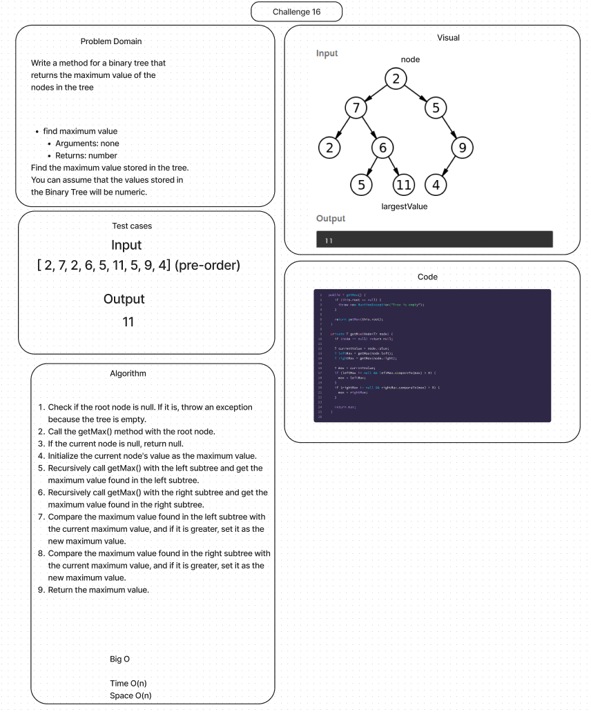

# Binary Tree and BST Implementation

## Features

Write the following method for the Binary Tree class

- find maximum value
  - Arguments: none
  - Returns: number

Find the maximum value stored in the tree. You can assume that the values stored in the Binary Tree will be numeric.

## Whiteboard Process

## Solution

[Link to Binary Tree Class](lib/src/main/java/datastructures/trees/BinaryTree.java)

[Link to Binary Tree Test](lib/src/main/java/datastructures/trees/BinaryTreeTest.java)
