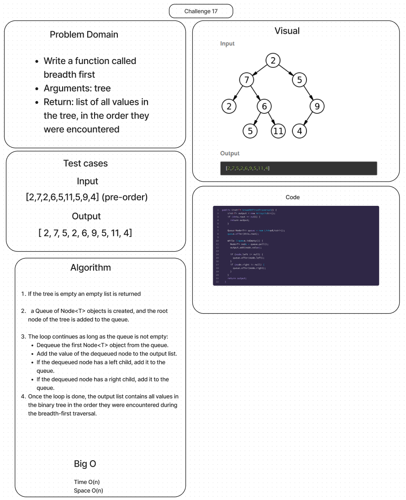

# Breadth-first Traversal.

## Features

Write a function called breadth first

Arguments: tree

Return: list of all values in the tree, in the order they were encountered

## Whiteboard Process

## Approach & Efficiency

- Time - O(n) each node must be visited once

- Space - O(n) a tree’s last level in the worst case for a binary tree

## Solution

[Link to Binary Tree Class](lib/src/main/java/datastructures/trees/BinaryTree.java)

[Link to Binary Tree Test](lib/src/main/java/datastructures/trees/BinaryTreeTest.java)
