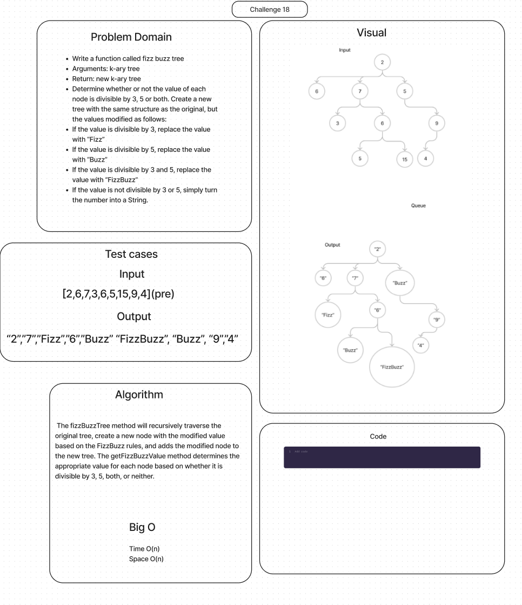

# Binary Tree getMax()

## Features

Write a function called fizz buzz tree

- Arguments: k-ary tree
- Return: new k-ary tree

Determine whether or not the value of each node is divisible by 3, 5 or both. Create a new tree with the same structure as the original, but the values modified as follows:

- If the value is divisible by 3, replace the value with “Fizz”
- If the value is divisible by 5, replace the value with “Buzz”
- If the value is divisible by 3 and 5, replace the value with “FizzBuzz”
- If the value is not divisible by 3 or 5, simply turn the number into a String.

## Whiteboard Process

## Approach & Efficiency

The space complexity of the fizzBuzzTree function is O(N), where N is the total number of nodes in the original k-ary tree. This is because the function creates a new node for each node in the original tree, resulting in the same number of nodes in the modified tree.

 The space complexity is O(h), where h is the height of the tree, if the tree is well-ordered. Otherwise, it would be O(n).

