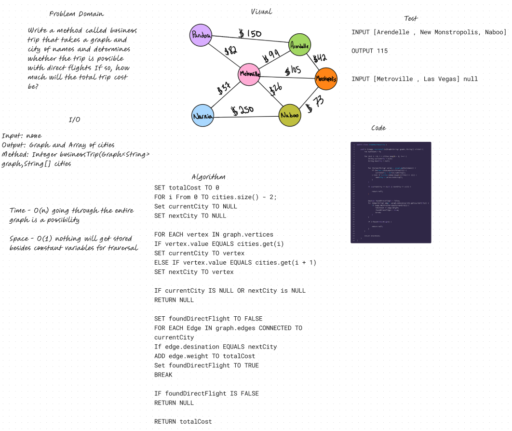

# Graph Business Trip

## Features

Write the following method:

- businessTrip
  - Arguments: graph, array of city names
  - Return: the cost of the trip (if it’s possible) or null (if not)

## Whiteboard Process

## Approach & Efficiency

We iterate over the input list of city names, find the corresponding vertices in the graph, check if a direct edge exists between each pair of consecutive cities, and calculate the total cost of the trip. If at any point we can't find a city in the graph or a direct flight to the next city, we return null.

## Solution

[Link to Graph Class](lib/src/main/java/codechallenges/linkedlist/GraphBusinessTrip.java)
