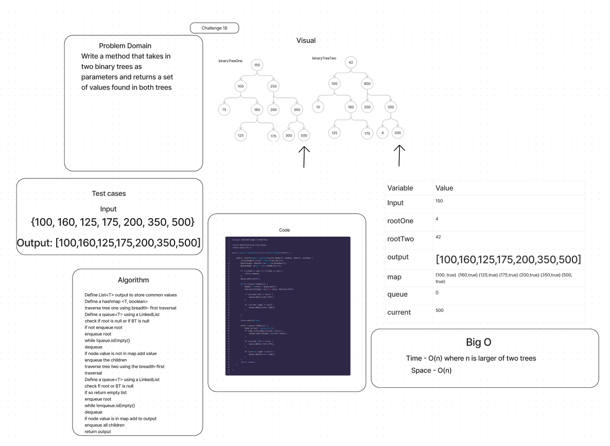

# Tree Intersection

## Features

Write a function called tree_intersection that takes two binary trees as parameters.

Using your Hashmap implementation as a part of your algorithm, return a set of values found in both trees.

## Whiteboard Process

## Approach & Efficiency

- The Big O time complexity for the traversals is O(n + m), as every node is visited exactly once. This can be simplified to O(n) for the larger of the two trees. The space complexity, if they completely intersect is O(n).

## Solution

[Link to Tree Intersection Class](lib/src/main/java/codechallenges/linkedlist/TreeIntersection.java)

[Link to Binary Tree Test](lib/src/test/java/codechallenges/linkedlist/TreeIntersectionTest.java)
