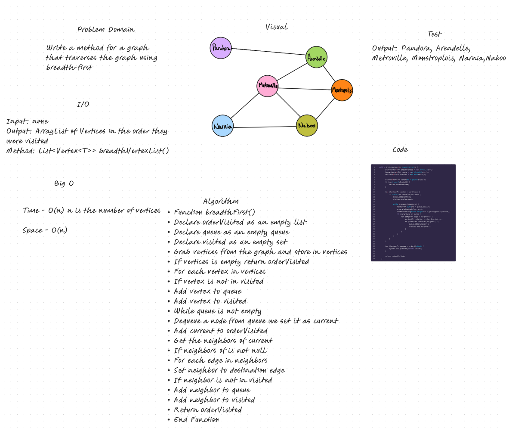

# Graph Breadth First

## Features

Write the following method for the Graph class:

- breadth first
  - Arguments: Node
  - Return: A collection of nodes in the order they were visited.
  - Display the collection

## Whiteboard Process

## Approach & Efficiency

This approach ensures that the breadth-first traversal visits all vertices in the graph, starting from each unvisited vertex. The visited set helps avoid revisiting already visited vertices. The orderVisited list keeps track of the order in which vertices are visited. Finally, the method returns the orderVisited list, which contains the vertices visited in breadth-first order.

## Solution

[Link to Graph Class](lib/src/main/java/datastructures/graph/Graph.java)
