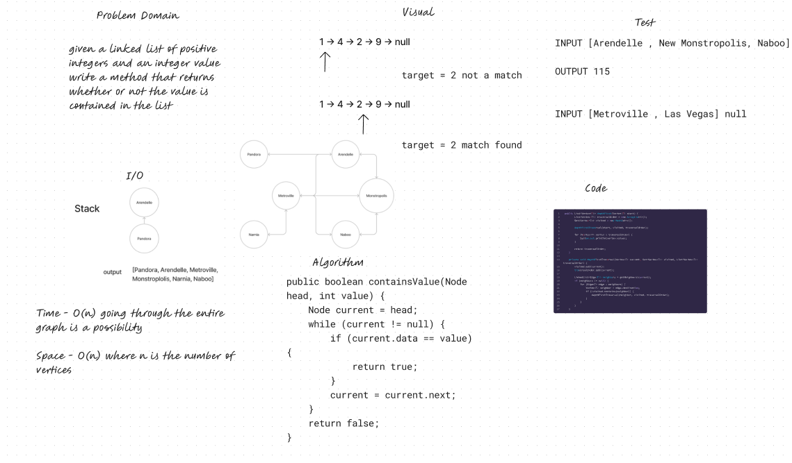

# Graph Depth First

## Features

Write the following method for the Graph class:

- depth first
  - Arguments: Node
  - Return: A collection of nodes in the order they were visited.
  - Display the collection

## Whiteboard Process

## Approach & Efficiency

The depthFirst method initializes an empty list traversalOrder to store the order in which vertices are visited, and a visited set to keep track of visited vertices.
It calls the depthFirstTraversal method, passing the starting vertex, the visited set, and the traversalOrder list.
The depthFirstTraversal method adds the current vertex to the visited set and the traversalOrder list.
It then retrieves the neighbors of the current vertex using the getNeighbors method and checks if there are any neighbors.
If there are neighbors and a neighbor has not been visited, the depthFirstTraversal method recursively calls itself with the neighbor as the new current vertex.
The recursion continues until all vertices reachable from the starting vertex have been visited.
Finally, the traversalOrder list is printed, and the method returns the list.

## Solution

[Link to Graph Class](lib/src/main/java/datastructures/graph/Graph.java)
