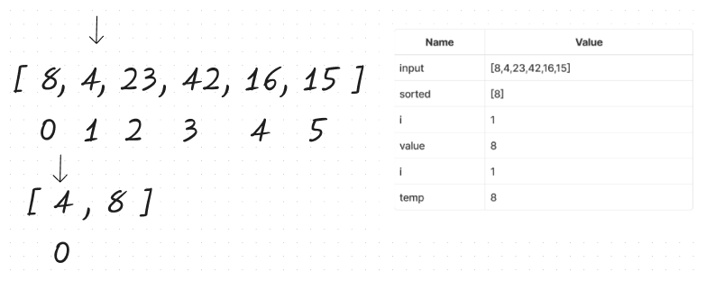

# Blog Notes: Insertion Sort

Selection Sort is an iterative sorting algorithm that gradually constructs a sorted sequence by repeatedly finding the minimum value in the array and placing it at the beginning. It achieves this by traversing the array multiple times, gradually building the sorted portion.

## Psuedocode

```psuedo
Insert(int[] sorted, int value)
  initialize i to 0
  WHILE value > sorted[i]
    set i to i + 1
  WHILE i < sorted.length
    set temp to sorted[i]
    set sorted[i] to value
    set value to temp
    set i to i + 1
  append value to sorted

InsertionSort(int[] input)
  LET sorted = New Empty Array
  sorted[0] = input[0]
  FOR i from 1 up to input.length
    Insert(sorted, input[i])
  return sorted
```

## Trace

Sample Array: `[8,4,23,42,16,15]`

### Pass 1



To begin, we create an empty array called "sorted" and assign its first element as the first element from the input array.

sorted = [8]

Next, we proceed to execute the Insert method starting from the second element of the input array, which is 4. This method takes the current sorted array and the value to be sorted as parameters.

Initially, we set i=0 and continue iterating as long as 4 is greater than every value in the sorted array. We increment i until that condition is met. However, in this particular pass, that condition is never satisfied, so we proceed to the next while loop. Inside this loop, we check if i is less than 1.

Since i is indeed less than 1, we assign the value 8 to a temporary variable called temp. Then, we replace 8 with 4, effectively shifting the previous element to the right. Next, we assign the value of temp (which is 8) to the variable "value". Finally, we increment i. As a result of these operations, we append 8 to the sorted array, resulting in [4, 8].


### Pass 2


Continuing from the previous step, where the sorted array is [4, 8], we proceed with the next iteration. We increment i to 2 and pass in the value 23 to the Insert method. Now, we iterate over the elements in the sorted array.

Since 23 is greater than every value in the sorted array, we bypass the second while loop without making any changes. As a result, we simply append the value 23 to the sorted array. After this step, the sorted array becomes [4, 8, 23].


### Pass 3


Continuing from the previous step, where the sorted array is [4, 8, 23], we proceed with the next iteration. We increment i to 3 and call the Insert method again, passing in the value 42.

First, we iterate over i while comparing 42 with each element in the sorted array. Since 42 is greater than every element in the sorted array, we continue incrementing i until we reach the end of the sorted array.

Once we have traversed the entire length of the sorted array, we append the value 42 to the end. As a result, the sorted array becomes [4, 8, 23, 42].


### Pass 4


Continuing from the previous step, where the sorted array is [4, 8, 23, 42], we proceed with the next iteration. We increment i to 4 and call the Insert method again, passing in the value 16.

First, we iterate over i while comparing 16 with each element in the sorted array. We continue until we reach i=2, where sorted[i] is equal to 23. However, the condition (16 > 23) is not met, so we move on to the second while loop.

Inside the second while loop, we loop through the entire length of the sorted array. We set temp to the value at index i (23), then replace that element with the value we want to sort (16). Next, we assign the value stored in temp (23) to the variable "value". We increment i and repeat this process, overwriting the value 42 with 23, but keeping track of the overwritten value (42) in the variable "value".

Finally, once we've reached the end of the array length, we append the value stored in "value" (42) to the end of the sorted array. As a result, the sorted array becomes [4, 8, 16, 23, 42]


### Pass 5


Continuing from the previous step, where the sorted array is [4, 8, 16, 23, 42], we proceed with the final pass. We call the Insert method with i = 5 for the input array, which has the value 15.

First, we increment i until we reach i = 2, as 16 is greater than 15. We then follow the process described in step 4. We store the current value at index i in a temporary variable called temp, overwrite that element with the value we want to sort (15), and assign the value stored in temp (16) to the variable "value".

We continue this process, iterating through the array, overwriting values and tracking the overwritten value in "value". Once we reach the end of the array, we append the value stored in "value" (42) to the end of the sorted array.

After these operations, the sorted array becomes [4, 8, 15, 16, 23, 42]. This is the final sorted sequence returned by the InsertionSort method.


## Efficiency


- Time: O(n^2)

We have to iterate over the entire input array once, and for each index, at worst we have to iterate over the entire sorted array, in the case of a reverse sorted array.

- Space: O(n)

We store a separate array that is the same size as the input array.
